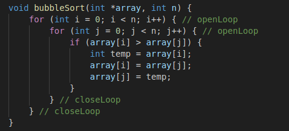

## Descrição

A classe `ReadFile` realiza as seguintes funções principais:
- Lê um arquivo de texto linha por linha usando a classe `Scanner`.
- Analisa o conteúdo do arquivo para identificar loops e funções.
- Determina se há recursão no código.
- Calcula a complexidade de tempo baseada na quantidade de loops e operações, utilizando a **notação Big-O**.

### Funcionalidades principais:
- **Identificação de Funções**: A classe captura os nomes das funções presentes no código.
- **Detecção de Loops**: Reconhece quando um loop é aberto e fechado, ajustando as variáveis correspondentes para calcular a complexidade.
- **Detecção de Recursão**: Verifica se há recursão no código, o que influencia diretamente a complexidade final.
- **Cálculo de Complexidade**: Baseado na quantidade de loops aninhados e operações, a classe retorna a análise assintótica e a notação Big-O do pior caso.

### Para melhor rendimento do analisador:
- Insira 'openLoops' quando for abrir um loop e 'closeLoop' para fechar um loop;
- Declare uma variável por linha, para que assertividade da análise seja melhor;

### Exemplo de padrão de código para melhor funcionamento do analisador:
